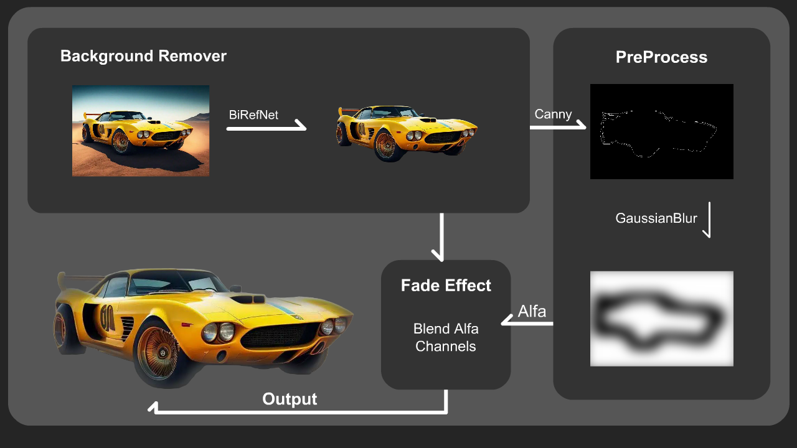
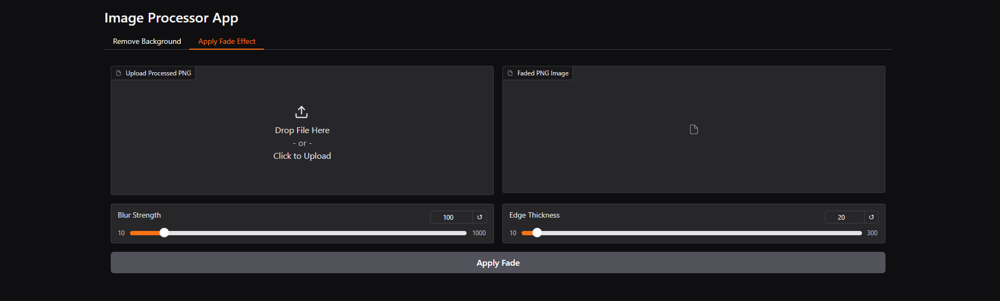

# FadeAway: Image Background Blending

FadeAway is an Background Removal and Fading Effect. Image processing application built with Python, Gradio, and PyTorch. It offers advanced image segmentation for background removal and fading effects. The app can run on either **CPU** or **GPU**, depending on your hardware capabilities.

---

# Architecture



# UI



## Features

### 1. Background Removal

- Removes the background of uploaded images and outputs a PNG with transparency.

### 2. Fade Effect

- Applies a fading effect with adjustable blur strength and edge thickness.

---

FadeAway automatically selects the appropriate Dockerfile based on your system hardware.

1. **Using GPU**:
   Run the following command:

   ```bash
   docker-compose up --build
   ```

2. **Using CPU**:
   Run the following command:
   ```bash
    docker build -t fadeaway_cpu -f Dockerfile_cpu .
    docker run -p 7537:7537 fadeaway_cpu
   ```
